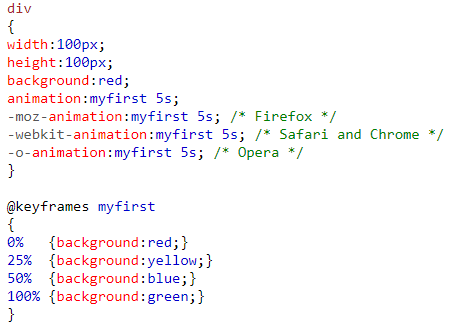

## CSS3详解
### CSS3边框
通过 CSS3，您能够创建圆角边框，向矩形添加阴影，使用图片来绘制边框 - 并且不需使用设计软件，比如 PhotoShop。
    
    border-radius
    border-image
    box-shadow

CSS3圆角边框：

CSS3边框阴影：

语法：box-shadow: h-shadow v-shadow blur spread color inset;

CSS3边框图片：

### CSS3背景

    background-size
    background-origin

CSS3 background-size 属性

background-size 属性规定背景图片的尺寸。在 CSS3 之前，背景图片的尺寸是由图片的实际尺寸决定的。在 CSS3 中，可以规定背景图片的尺寸，这就允许我们在不同的环境中重复使用背景图片。您能够以像素或百分比规定尺寸。如果以百分比规定尺寸，那么尺寸相对于父元素的宽度和高度。

CSS3 background-origin 属性

background-origin 属性规定背景图片的定位区域。背景图片可以放置于 content-box、padding-box 或 border-box 区域。

### CSS3文本效果

    text-shadow
    word-wrap

CSS3文本阴影

CSS3自动换行

### CSS3字体 @font-face
通过 CSS3，web 设计师可以使用他们喜欢的任意字体。在新的 @font-face 规则中，您必须首先定义字体的名称（比如myFirstFont），然后指向该字体文件。如需为 HTML 元素使用字体，请通过 font-family 属性来引用字体的名称 (myFirstFont)：

### CSS3 2D 3D 转换 transform
可参考 CSS3 transform 博文

### CSS3 过渡 transition
通过 CSS3，我们可以在不使用 Flash 动画或 JavaScript 的情况下，当元素从一种样式变换为另一种样式时为元素添加效果。要实现这一点，必须规定两项内容：

    规定你希望把效果添加到哪个CSS属性上
    规定效果的时长

### CSS3 动画 @keyframes animation

### CSS3 多列
    column-count
    column-gap
    column-rule

